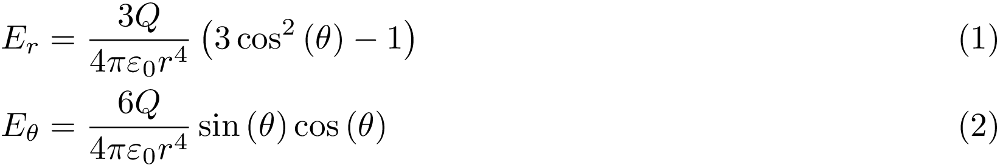
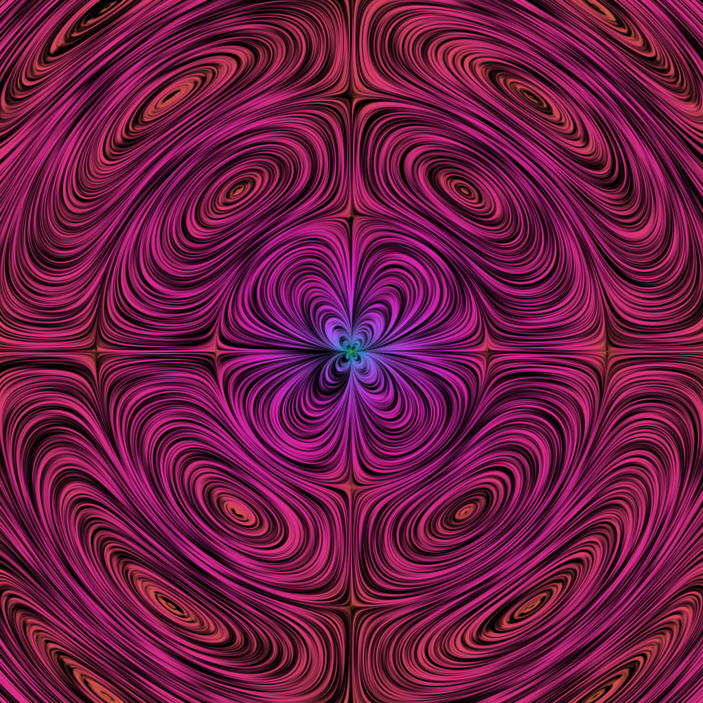
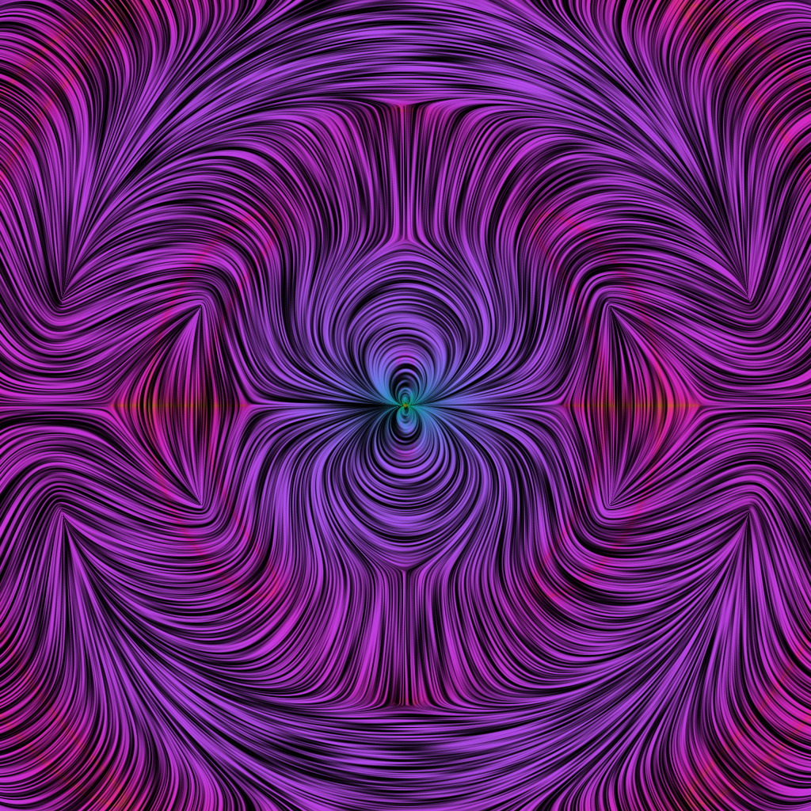

# Gravitational Eigenfield Visualization

## Overview
This project was undertaken by Oliver Evans, Nick Gantzler, and Ryan Bugoki as a final project for Electromagnetism I with Dr. Jutta Luettmer-Strathmann at The University of Akron in Fall 2016.

Our task was to read [this paper](https://arxiv.org/abs/1212.4730) by Price et. al. which describes the similarities and differences between electromagnetic and gravitational radiation and presents Line Integral Convolution as an effective technique for visualizing the corresponding fields.

The particular system we study here is the axissymmetric quadrupole, which is the simplest multipole which produces radiation in both its electric and gravitational forms. Axissymmetry is desired so as to reduce the 3D visualization problem to a 2D problem.

## Fundamental conceptual differences
Electric fields are generally straightforward to visualize. They are vector quantities, with a magnitude and direction, and they have an intuitive physical interpretation - that is, at any point, a positive test charge would experience force in the direction of the field. gravitational fields, however, are not so easy to conceptualize.

First and foremost, gravitational fields cannot be described adequately by vector fields. They must be described via fields of tensors of rank 2 (matrix fields). In this case, we do not simply have a magnitude and direction which could, for example, be represented by an field of arrows. Rather, since the gravitational matrix varies as a function of space, at each point, it is a regular 3x3 matrix of real numbers. Then, we calculate the eigenvalues and eigenvectors of the matrix. Repeating this value across a fine mesh over some interval of interest generates a vector field which can be visualized using standard methods.

## Line Integral Convolution
The particular visualization technique utilized here is Line Integral Convolution (LIC) (described [here](http://cs.brown.edu/courses/csci2370/2000/1999/cabral.pdf)), which, more or less, does the following. We begin with an image of noise - random black, white, and gray pixels. Think of sand. No particular order or meaning, but not blank. Then, imagine tracing lines in the sand following the path which the arrows of a standard quiver plot would direct you. In essence, we smear the noise along solution curves to the autonomous system of 2 first order ODEs associated with the vector field. The primary advantage of this method over quiver or streamline plots is that it can represent the field at much higher resolutions than would be feasible with standard visualization techniques. While LIC gives detail at the pixel level, thousands of streamlines or arrows in an image would be so difficult to decipher that they would provide very little information.

The primary feature which this work adds to the work done by Price et. al. is to color the field images using the magnitude of the field in the electric case, and the absolute value of the eigenvalue in the gravitational case.

## Field equations
From the paper by Price et. al., we were able to calculate the following for the electric and gravitational fields of the two quadrupoles.

### Electric Quadrupole

#### Static

#### Oscillating

### Gravitational Quadrupole

#### Static

#### Oscillating

## Results

### Electric Quadrupole

#### Static

#### Oscillating

[Youtube](https://www.youtube.com/watch?v=xRnNFwoTh7Q) (Streaming - low quality)

[Google Drive](https://drive.google.com/open?id=0BwrkNDlHuDWKcXVlMkVqT0hHWlU) (Download - high quality)

### Gravitational Quadrupole

#### Static

##### Positive Eigenvalue

##### Negative Eigenvalue

#### Oscillating

##### Positive Eigenvalue

[Youtube](https://www.youtube.com/watch?v=YRXS0L8XMn0&feature=youtu.be) (Streaming - low quality)

[Google Drive](https://drive.google.com/open?id=0BwrkNDlHuDWKdlhDaWlPd0JKUjg) (Download - high quality)

##### Negative Eigenvalue

[Youtube](https://www.youtube.com/watch?v=BGd5IJogzog&feature=youtu.be) (Streaming - low quality)

[Google Drive](https://drive.google.com/open?id=0BwrkNDlHuDWKd2diTnZvLWY3RW8) (Download - high quality)

## References
Cabral, Brian; Leedom, Leith Casey (August 2–6, 1993). Imaging Vector Fields Using Line Integral Convolution. Proceedings of the 20th annual conference on Computer graphics and interactive techniques. SIGGRAPH '93. Anaheim, California. pp. 263–270. http://cs.brown.edu/courses/csci2370/2000/1999/cabral.pdf

Peyre, Gabriel (2008). Toolbox Image, MATLAB Central File Exchange. Retrieved December 14, 2016. <https://www.mathworks.com/matlabcentral/fileexchange/16201-toolbox-image>

Peyre, Gabriel (2009). Toolbox Diffc, MATLAB Central File Exchange. Retrieved December 14, 2016. <https://www.mathworks.com/matlabcentral/fileexchange/5103-toolbox-diffc>

Price, Richard H. (Texas U., Brownsville), Belcher, John W. (MIT, Cambridge, Dept. Phys.), Nichols, David A. (Caltech). 
Comparison of electromagnetic and gravitational radiation: What we can learn about each from the other.
Dec 2012. 22 pp.
Published in Am.J.Phys. 81 (2013) 575 <https://arxiv.org/abs/1212.4730>

Kristen M. Thyng, Chad A. Greene, Robert D. Hetland, Heather M. Zimmerle, and Steven F. DiMarco. True colors of oceanography: Guidelines for effective and accurate colormap selection. Oceanography, September 2016. <http://dx.doi.org/10.5670/oceanog.2016.66>
